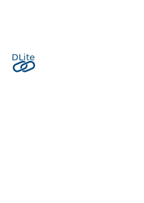
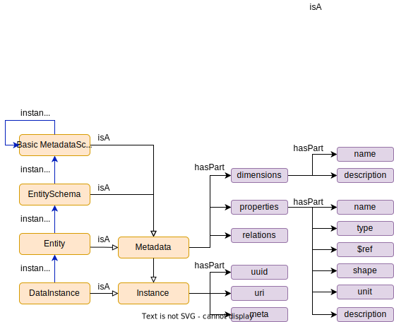

DLite
=====
> A lightweight data-centric framework for semantic interoperability


[](https://github.com/SINTEF/dlite/releases)
[](https://pypi.org/project/DLite-Python/)

Content
-------
  * [About DLite](#about-dlite)
    - [Example](#example)
    - [Main features](#main-features)
  * [Installing DLite](#installing-dlite)
    - [Installing with pip](#installing-with-pip)
    - [Docker image](#docker-image)
    - [Compile from sources](#compile-from-sources)
      - [Dependencies](#dependencies)
        - [Runtime dependencies](#runtime-dependencies)
        - [Build dependencies](#build-dependencies)
      - [Build and install with Python](#build-and-install-with-python)
      - [Build on Linux](#build-on-linux)
      - [Build on Windows](#build-on-windows)
        - [Quick start with VS Code and Remote Container](#quick-start-with-vs-code-and-remote-container)
      - [Build documentation](#build-documentation)
    - [Setting up the environment](#setting-up-the-environment)
  * [Short vocabulary](#short-vocabulary)
  * [License](#license)
  * [Acknowledgment](#acknowledgment)


DLite is a lightweight interoperability framework, for working with and
sharing scientific.


About DLite
===========
DLite is a C implementation of the [SINTEF Open Framework and Tools
(SOFT)][1], which is a set of concepts and tools for how to
efficiently describe and work with scientific data.

All data in DLite is represented by an Instance, which is build on a
simple data model.  An Instance is identified by a unique UUID and
have a set of named dimensions and properties.  It is described by its
Metadata.  In the Metadata, each dimension is given a name and
description (optional) and each property is given a name, type, shape
(optional), unit (optional) and description (optional).  The shape of
a property refers to the named dimensions.

When an Instance is instantiated, you must suply a value to the named
dimensions.  The shape of the properties will be set according to
that.  This ensures that the shape of the properties are internally
consistent.

A Metadata is also an Instance, and hence described by its
meta-metadata.  By default, DLite defines four levels of metadata;
instance, metadata, metadata schema and basic metadata schema. The
basic metadata schema describes itself, so no further meta levels are
needed.  The idea is if two different systems describes their data
model in terms of the basic metadata schema, they can easily be made
semantically interoperable.



An alternative and more flexible way to enable interoperability is to
use a common ontology.  DLite provides a specialised Instance called
Collection.  A collection is essentially a container holding a set of
Instances and relations between them.  But it can also relate an
Instance or even a dimension or property of an instance to a concept
in an ontology.  DLite allows to transparently map an Instance whos
Metadata corresponding to a concept in one ontology to an Instance
whos Metadata corresponding to a concept in another ontology.  Such
mappings can easily be registered (in C or Python) and reused,
providing a very powerful system for achieving interoperability.

DLite provides also a common and extendable API for loading/storing
Instances from/to different storages.  New storage plugins can be
written in C or Python.

See [doc/concepts.md](doc/concepts.md) for more details.

DLite is licensed under the MIT license.


Example
-------
Lets say that you have the following Python class

```python
class Person:
    def __init__(self, name, age, skills):
        self.name = name
        self.age = age
        self.skills = skills
```

that you want to describe semantically.  We do that by defining the
following metadata (using json) identifying the Python attributes with
dlite properties.  Here we define `name` to be a string, `age` to be a
float and `skills` to be an array of `N` strings, where `N` is a name
of a dimension.  The metadata uniquely identifies itself with the
"name", "version" and "namespace" fields and "meta" refers the the
metadata schema (meta-metadata) that this metadata is described by.
Finally are human description of the metadata itself, its dimensions
and its properties provide in the "description" fields.

```json
{
  "name": "Person",
  "version": "0.1",
  "namespace": "http://onto-ns.com/meta",
  "meta": "http://onto-ns.com/meta/0.3/EntitySchema",
  "description": "A person.",
  "dimensions": [
    {
      "name": "N",
      "description": "Number of skills."
    }
  ],
  "properties": [
    {
      "name": "name",
      "type": "string",
      "description": "Full name."
    },
    {
      "name": "age",
      "type": "float",
      "unit": "year",
      "description": "Age of person."
    },
    {
      "name": "skills",
      "type": "string",
      "dims": ["N"],
      "description": "List of skills."
    }
  ]
}
```

We save the metadata in file "Person.json".  Back in Python we can now
make a dlite-aware subclass of `Person`, instantiate it and serialise
it to a storage:

```python
import dlite

# Create a dlite-aware subclass of Person
DLitePerson = dlite.classfactory(Person, url='json://Person.json')

# Instantiate
person = DLitePerson('Sherlock Holmes', 34., ['observing', 'chemistry',
    'violin', 'boxing'])

# Write to storage (here a json file)
person.dlite_inst.save('json://homes.json?mode=w')
```

To access this new instance from C, you can first generate a header
file from the meta data

```console
$ dlite-codegen -f c-header -o person.h Person.json
```

and then include it in your C program:

```c
// homes.c -- sample program that loads instance from homes.json and prints it
#include <stdio.h>
#include <dlite.h>
#include "person.h"  // header generated with dlite-codegen

int main()
{
  /* URL of instance to load using the json driver.  The storage is
     here the file 'homes.json' and the instance we want to load in
     this file is identified with the UUID following the hash (#)
     sign. */
  char *url = "json://homes.json#315088f2-6ebd-4c53-b825-7a6ae5c9659b";

  Person *person = (Person *)dlite_instance_load_url(url);

  int i;
  printf("name:  %s\n", person->name);
  printf("age:   %g\n", person->age);
  printf("skills:\n");
  for (i=0; i<person->N; i++)
    printf("  - %s\n", person->skills[i]);

  return 0;
}
```
Now run the python file and it would create a homes.json file, which contains an entity information.
Use the UUID of the entity from the homes.json file, and update the url variable in the homes.c file.

Since we are using `dlite_instance_load_url()` to load the instance,
you must link to dlite when compiling this program.  Assuming you are
using Linux and dlite in installed in `$HOME/.local`, compiling with
gcc would look like:

```console
$ gcc homes.c -o homes -I$HOME/.local/include/dlite -L$HOME/.local/lib -ldlite -ldlite-utils
```
Or if you are using the development environment , you can compile using:
```console
$ gcc -I/tmp/dlite-install/include/dlite -L/tmp/dlite-install/lib -o homes homes.c -ldlite -ldlite-utils
```

Finally you can run the program with

```console
$ DLITE_STORAGES=*.json ./homes
name:  Sherlock Holmes
age:   34
skills:
  - observing
  - chemistry
  - violin
  - boxing
```

Note that we in this case have to define the environment variable
`DLITE_STORAGES` in order to let dlite find the metadata we stored in
'Person.json'.  There are ways to avoid this, e.g. by hardcoding the
metadata in C using `dlite-codegen -f c-source` or in the C program
explicitely load 'Person.json' before 'homes.json'.

This was just a brief example.  There is much more to dlite.  Since
the documentation is still not complete, the best source is the code
itself, including the tests and examples.


Main features
-------------
See [doc/features.md](doc/features.md) for a more detailed list.
  - Enables semantic interoperability via simple formalised metadata and data
  - Metadata can be linked to or generated from ontologies
  - Code generation for simple integration in existing code bases
  - Plugin API for data storages (json, hdf5, rdf, yaml, postgresql, blob, csv...)
  - Plugin API for mapping between metadata
  - Bindings to C, Python and Fortran


Installing DLite
================

Installing with pip
-------------------
If you are using Python, the easiest way to install DLite is with pip:

    pip install DLite-Python

Note, currently only Linux versions for Python 3.7, 3.8, 3.9 and 3.10
are available.  But Windows versions will soon be available.

Docker image
------------
A docker image is available on
[https://github.com/SINTEF/dlite/packages][dlite-packages].


Compile from sources
--------------------
The sources can be cloned from GitHub

    git clone ssh://git@git.code.sintef.no/sidase/dlite.git


### Dependencies

#### Runtime dependencies
  - [HDF5][3], optional (needed by HDF5 storage plugin)
  - [librdf][4], optional (needed by RDF (Redland) storage plugin)
  - [Python 3][5], optional (needed by Python bindings and some plugins)
    - [NumPy][6], required if Python is enabled
    - [PyYAML][7], optional (used for generic YAML storage plugin)
    - [psycopg2][8], optional (used for generic PostgreSQL storage plugin)
    - [pandas][pandas], optional (used for csv storage plugin)

#### Build dependencies
  - [cmake][9], required for building
  - hdf5 development libraries, optional (needed by HDF5 storage plugin)
  - librdf development libraries, optional (needed by librdf storage plugin)
  - Python 3 development libraries, optional (needed by Python bindings)
  - NumPy development libraries, optional (needed by Python bindings)
  - [SWIG v3][10], optional (needed by building Python bindings)
  - [Doxygen][11], optional, used for documentation generation
  - [valgrind][12], optional, used for memory checking (Linux only)
  - [cppcheck][13], optional, used for static code analysis


Compiling
---------

### Build and install with Python
Given you have a C compiler and Python correctly installed, you should be
able to build and install dlite via the python/setup.py script:

    cd python
    python setup.py install


### Build on Linux
Install the hdf5 (does not include the parallel component) libraries

On Ubuntu:

    sudo apt-get install libhdf5-serial-dev

On Redhad-based distributions (Fedora, Centos, ...):

    sudo dnf install hdf5-devel

Build with:

    mkdir build
    cd build
    cmake ..
    make

Before running make, you may wish to configure some options with
`ccmake ..`

For example, you might need to change CMAKE_INSTALL_PREFIX to a
location accessible for writing. Default is ~/.local

To run the tests, do

    make test        # same as running `ctest`
    make memcheck    # runs all tests with memory checking (requires
                     # valgrind)

To generate code documentation, do

    make doc         # direct your browser to build/doc/html/index.html

To install dlite locally, do

    make install


### Build on Windows
See [here](doc/build_with_vs.md) for detailed instructions for building with
Visual Studio.


#### Quick start with VS Code and Remote Container
Using Visual Studio Code it is possible to do development on the
system defined in Dockerfile.

1. Download and install [Visual Studio Code](https://code.visualstudio.com/).
2. Install the extension __Remote Development__.
3. Clone _dlite_ and initialize git modules: `git submodule update --init`.
4. Open the _dlite_ folder with VS Code.
5. Start VS Code, run the *Remote-Containers: Open Folder in
   Container...* command from the Command Palette (F1) or quick
   actions Status bar item. This will build the container and restart
   VS Code in it. This may take some time the first time as the Docker
   image must be built. See [Quick start: Open an existing folder in a
   container][vs-container] for more information and instructions.
6. In the container terminal, perform the first build and tests with
   `mkdir /workspace/build; cd /workspace/build; cmake ../dlite; make &&
   make test`.


### Build documentation
If you have [doxygen][11] installed, the html documentation should be generated
as a part of the build process.  It can be browsed by opening the following file
in your browser:

    <build>/doc/html/index.html

where `<build>` is your build folder.  To only build the documentation, you can
do:

    cd build
    cmake --build . --target doc

If you have LaTeX and make installed, you can also the latex documentation with

    cd build
    cmake --build . --target latex

which will produce the file

    <build>/doc/latex/refman.pdf


Setting up the environment
--------------------------
If dlite is installed in a non-default location, you may need to set
the PATH, LD_LIBRARY_PATH, PYTHONPATH and DLITE_ROOT environment
variables.  See the [documentation of environment
variables](doc/environment_variables.md) for more details.

An example of how to use dlite is shown above.  See also the examples
in the [examples](examples) directory for how to link to dlite from C
and use of the Fortran bindings.


Short vocabulary
================
The following terms have a special meaning in dlite:
  - **Basic metadata schema**: Toplevel meta-metadata which describes itself.
  - **Collection**: A specialised instance that contains references to set
    of instances and relations between them.  Within a collection instances
    are labeled.  See also the [SOFT5 nomenclauture][SOFT5_nomenclauture].
  - **Data instance**: A "leaf" instance that is not metadata.
  - **Entity**: May be any kind of instance, including data instances,
    metadata instances or meta-metadata instances.  However, for historical
    reasons it is often used for "standard" metadata that are instances of
    meta-metadata "http://onto-ns.com/meta/0.3/EntitySchema".
  - **Instance**: The basic data object in DLite.  All instances are described
    by their metadata which itself are instances.  Instances are identified
    by an UUID.
  - **Mapping**: A function that maps one or more input instances to an
    output instance.  They are an important mechanism for interoperability.
    Mappings are called translators in SOFT5.
  - **Metadata**: a special type of instances that describe other instances.
    All metadata are immutable and has an unique URI in addition to their
    UUID.
  - **Meta-metadata**: metadata that describes metadata.
  - **Relation**: A subject-predicate-object triplet. Relations
    are immutable.
  - **Storage**: A generic handle encapsulating actual storage backends.
  - **Transaction**: A not yet implemented feature, that enables to
    represent the evolution of the state of a software as a series of
    immutable instances.  See also the
    [SOFT5 nomenclauture][SOFT5_nomenclauture].
  - **uri**: A [uniform resource identifier (URI)][URI] is a
    generalisation of URL, but follows the same syntax rules.  In
    dlite, the term "uri" is used as an human readable identifier for
    instances (optional for data instances) and has the form
    `namespace/version/name`.
  - **url**: A [uniform resource locator (URL)][URL] is an reference
    to a web resource, like a file (on a given computer), database
    entry, web page, etc.  In dlite url's refer to a storage or even
    an specific instance in a storage using the general syntax
    `driver://location?options#fragment`, where `options` and `fragment`
    are optional.  If `fragment` is provided, it should be the uuid or
    uri of an instance.
  - **uuid**: A [universal unique identifier (UUID)][UUID] is commonly
    used to uniquely identify digital information.  DLite uses the 36
    character string representation of uuid's to uniquely identify
    instances.  The uuid is generated from the uri for instances that
    has an uri, otherwise it is randomly generated.


License
=======
DLite is licensed under the [MIT license](LICENSE).  However, it
include a few third party source files with other permissive licenses.
All of these should allow dynamic and static linking against open and
propritary codes.  A full list of included licenses can be found in
[LICENSES.txt](src/utils/LICENSES.txt).


Acknowledgment
==============
In addition from internal funding from SINTEF and NTNU this work has
been supported by several projects, including:

  - [AMPERE](https://www.sintef.no/en/projects/2015/ampere-aluminium-alloys-with-mechanical-properties-and-electrical-conductivity-at-elevated-temperatures/) (2015-2020) funded by Forskningsrådet and Norwegian industry partners.
  - FICAL (2015-2020) funded by Forskningsrådet and Norwegian industry partners.
  - [SFI Manufacturing](https://www.sfimanufacturing.no/) (2015-2023) funded by Forskningsrådet and Norwegian industry partners.
  - [SFI PhysMet](https://www.ntnu.edu/physmet)(2020-2028) funded by Forskningsrådet and Norwegian industry partners.
  - [OntoTrans](https://cordis.europa.eu/project/id/862136) (2020-2024) that receives funding from the European Union’s Horizon 2020 Research and Innovation Programme, under Grant Agreement n. 862136.
  - [OpenModel](https://www.open-model.eu/) (2021-2025) that receives funding from the European Union’s Horizon 2020 Research and Innovation Programme, under Grant Agreement n. 953167.
  - [VIPCOAT](https://www.vipcoat.eu/) (2021-2025) that receives funding from the European Union’s Horizon 2020 Research and Innovation Programme, under Grant Agreement n. 952903.


---

DLite is developed with the hope that it will be a delight to work with.

[1]: https://stash.code.sintef.no/projects/SOFT/repos/soft5/
[2]: https://github.com/NanoSim/Porto/blob/porto/Preview-Final-Release/doc/manual/02_soft_introduction.md#soft5-features
[3]: https://support.hdfgroup.org/HDF5/
[4]: https://librdf.org/
[5]: https://www.python.org/
[6]: https://pypi.org/project/numpy/
[7]: https://pypi.org/project/PyYAML/
[8]: https://pypi.org/project/psycopg2/
[9]: https://cmake.org/
[10]: http://www.swig.org/
[11]: http://www.doxygen.org/
[12]: http://valgrind.org/
[13]: http://cppcheck.sourceforge.net/
[SOFT5_nomenclauture]: https://confluence.code.sintef.no/display/SOFT/Nomenclature
[UUID]: https://en.wikipedia.org/wiki/Universally_unique_identifier
[URL]: https://en.wikipedia.org/wiki/URL
[URI]: https://en.wikipedia.org/wiki/Uniform_Resource_Identifier
[IRI]: https://en.wikipedia.org/wiki/Internationalized_Resource_Identifier
[dlite-packages]: https://github.com/SINTEF/dlite/packages
[vs-container]: https://code.visualstudio.com/docs/remote/containers#_quick-start-open-an-existing-folder-in-a-container
[pandas]: https://pandas.pydata.org/
