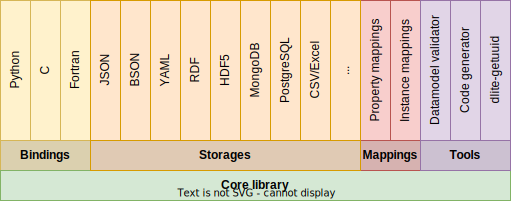
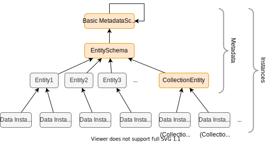

DLite
=====
DLite is an implementation of [SOFT], which stands for SINTEF Open
Framework and Tools and is a set of concepts for how to achieve
semantic interoperability as well as implementations and corresponding
tooling.

The development of SOFT was motivated by many years of experience with
developing scientific software, where it was observed that a lot of
efforts went into developing parts that had little to do with the
domain.
A significant part of the development process was spent on different
software engineering tasks, such as code design, the handling of I/O,
correct memory handling of the program state and writing import and
export filters in order to use data from different
sources.
In addition comes the code maintenance with support of legacy formats
and the introduction of new features and changes to internal data
state in the scientific software.
With SOFT it is possible to utilize reusable software components that
handle all this, or develop new reusable software components that can
be used by others in the same framework.
At the core of SOFT are the [SOFT data models], which provide a by
design simplistic but powerful way to represent scientific data.

Originally DLite started as a simplified pure C implementation of SOFT
based on [SOFT5], but has with time developed into a robust framework
with a large set of [features].

The main components of DLite is shown in Figure 1, including language
bindings, tools the plugin framework for storages and mappings.

_**Figure 1.** DLite Architecture._

DLite contains a core library, implementing a simplistic, but powerful
datamodel-based framework for semantic interoperability.
On top of this, it implements a set of bindings, storages, mappings
and tools.
The library also comes with set of interfaces (API) to create
extensions and custom plugins.

DLite currently provide bindings with well-documented APIs to Python,
C and Fortran.
For C and Fortran it provide tools for code generation for easy and
efficient integration into simulation software.
The Python bindings are dynamic in nature and provide a simple way to
interact with semantic data from Python.

It also provide a plugin architecture for storages and mappings and
comes with a set of generic storages.
The plugins can be written either in C or Python and are available any
of the bindings (including C and Fortran) due to the embedded Python
interpreter.

The main approach to developing software with DLite is to
incrementally describe the domain of the software using data models
(see below).
The data models can represent different elements of the software, and
be used in handling I/O as well as in code generation and
documentation.
Data models can also be used for annotating data and data sets.
This might be useful in cases where for instance the origin of the
data, license and ownership are of importance.

Since any complex software will have many data models and often multiple
instances of the same data model, DLite allows for creating collections of
data models with defined relationships.

One idea of SOFT is that software may be written is such way that
business logic is handled by the codebase, while I/O, file-formats,
version handling, data import/export and interoperability can be
handled by reusable components in the DLite-framework, thus reducing
risk and development time.

Datamodel hierarchy
-------------------

_**Figure 2.** Datamodel hierarchy.  The instances colored orange are
predefined, while the other may be defined by the user.  Data
instances 5 and 6 are what we normally will call a collection._

Figure 2 shows the datamodel hierarchy implemented in DLite.
As a user, you will almost always deal with only entities or data
instances, but the hierarchy gives DLite a strong and theoretically
well-defined schema.

The actual data or *Data instances* are instances of the *Entity* that
describes them.
*Entities* are instances of the *EntitySchema* The *EntitySchema* is
an instance of the *BasicMetadataSchema*, is an instance of itself
(meaning that it can be used to describe itself).
Hence, in DLite is **everything is an instance**.
This has a practical implication that the API for instances can be applied
to all metadata as well.
Since the BasicMetadataSchema can describe itself, no more abstraction
levels are needed, making the DLite metadata schema complete and well-defined.

From Figure 2, one can also see that *[collections]* are simply
instances of the *CollectionEntity*.

In DLite all instances that describe other instances (of a lower abstraction
level) are called *metadata*.

Compared to ontologies, *data instances* correspond to OWL individuals
while *entities* correspond to OWL classes.
OWL, which is based on first order logic, do not have concepts corresponding
to the higher abstraction levels of EntitySchema and BasicMetadataSchema.

A (so far unexplored possibility) with such a datamodel hierarchy is
that it can enable cross-platform semantic interoperability between
independent systems that describe their datamodel hierarchies using a
common BasicMetadataSchema.
Of cause, this require a common agreement of the BasicMetadataSchema.

### Entities
An entity can be a single thing or object that represents something
physical or nonphysical, concretely or abstract.
The entity contains information about the data that constitutes the
state of thing it describes.
The entity does not contain the actual data, but describes what the
different data fields are, in terms of name, data types, units,
dimensionality etc.
Information about data is often called metadata.
Formal meta data enables for the correct interpretation of a set of
data, which otherwise would be unreadable.

An example of an entity is 'Atom', which can be defined as something
that has a position, an atomic number (which characterizes the
chemical element), mass, charge, etc.
Another example of a completely different kind of entity can be a data
reference-entity with properties such as name, description, license,
access-url, media-type, format, etc). The first entity is suitable as
an object in a simulation code, while the latter is more suitable for
a data catalog distribution description (e.g. [dcat:Distribution]).
Entities allows for describing many aspects of the domain.
While each entity describes a single unit of information, a set of
entities can describe the complete domain.

#### Uniqueness & immutability
To ensure consistency, no entity (or other metadata) should never be
changed once published.
They are uniquely identified by their *URI*, which has 3 separate
elements: a namespace, a version number and a name.
An entity named 'Particle' is unlikely to have the same meaning and
the set of parameters across all domains.
In particle physics, the entity 'Particle' would constitute matter and
radiation, while in other fields the term 'Particle' can be a general
term to describe something small.
For this reason SOFT entities have namespaces, similar to how
vocabularies are defined in OWL.
The version number is a pragmatic solution to handle how properties of
an entity might evolve during the development process.
In order to handle different versions of a software, the entity
version number can be used to identify the necessary transformation
between two data sets.

For example, the URI for the EntitySchema is
http://onto-ns.com/meta/0.3/EntitySchema, with
`http://onto-ns.com/meta` being the namespace, `0.3` the version and
`EntitySchema` the name.
URIs do not have to be resolvable, but it is good practice that they
resolves to their definition.

### Instances
Instances are identified by an [universally unique identifier (UUID)],
which is a 128 bit label expressed as a string of the form
`8290318f-258e-54e2-9838-bb187881f996`.
Since a metadata are instances, they do also have an UUID (which is
calculated as a hash of their URI).

DLite also allow the user to identify a data instance with a human
readable URI.
Like for metadata, the UUID will then be calculated as a hash of the
URI.
The tool `dlite-getuuid` can be used to manually convert URIs to their
corresponding UUIDs.

Currently DLite does not enforce that user-defined URIs must follow
the [RFC 3986] standard for a [valid URI], but it is recommended to do
so in order to allow using the URI as a valid [RDF]
subject or object in a knowledge base.
For this purpose, DLite also allow to refer to data instances using
id's of the form `<metadata_uri>/<uuid>` (for example
http://onto-ns.com/meta/0.1/Collection/db6e092b-20f9-44c1-831b-bd597c96daae).

Metadata semantics
------------------
The DLite data model is defined by the [Datamodel ontology].

The semantics used to by any type of metadata to describe its instances
contains three elements:

  - dimensions
  - properties
  - relations

The three first properties of all metadata schemas (metadata who's
instances are metadata) must be "dimensions", "properties" and
"relations" in this order.  However, it is possible to omit
"relations" if the metadata instance has no other properties.

metadata and '`uuid`' is the UUID of the instance.  This has the
advantage that the the URI of an instance will be a valid [RDF]
subject or object in a knowledge base.  In the Python bindings, the
`Instance.get_uri()` method and `Instance.namespace` property will return a
string in this format if the instance has no URI.

Instances can be subdivided into:

  - *Data instances* containing actual data.  These are serialised with a
    minimal header, only containing:
      - The UUID identifying the instance.
      - An optional reference to an URI uniquely identifying the instance.
        If given, the UUID is derived from it.
      - A reference (URI) to its metadata.

    This header is then followed by then followed by the content,
    i.e. the size of each dimension and the values of each property.

    A basic `DLiteInstance` type is defined that all data instances
    (including metadata) can be cast into.

    In the figure above, the *Data instances* and the *Collections* are
    both examples of *pure instances*.

  - Metadata.  Entities, Entity schema, Basic metadata schema, etc are
    all examples of metadata.  Metadata is typically identified by an
    URI of the form `namespace/version/name`.  When storing entities
    (as instances) an UUID will be derived from this URI.

    A basic `DLiteMetadata` type is defined, that all metadata can be
    cast into.  Since metadata also are instances, they header starts
    with the same header as DLiteInstance, but includes more fields
    needed to describe their instances.  Entities are a special case
    of metadata, whos instances are the actual data.

    All metadata is immutable.

Naming dimensions and properties
--------------------------------
The names of your dimensions and properties should be valid C identifiers,
not starting with underscore.  Another restriction is that should not be
one of the following keywords:

  - uuid
  - uri
  - meta

Furthermore, while the following dimension and property names are
actively used in metadata, they must not be used in data instances:

  - ndimensions
  - nproperties
  - nrelations
  - dimensions
  - properties
  - relations

---

[SOFT]: https://www.sintef.no/en/publications/publication/1553408/
[SOFT data models]: https://github.com/NanoSim/Porto/blob/porto/Preview-Final-Release/doc/manual/02_soft_introduction.md#soft5-features
[SOFT5]: https://github.com/NanoSim/Porto/blob/porto/Preview-Final-Release/doc/manual/02_soft_introduction.md
[features]: features.md
[collections]: collections.md
[dcat:Distribution]: https://www.w3.org/TR/vocab-dcat-3/#Class:Distribution
[UUID]: https://en.wikipedia.org/wiki/Universally_unique_identifier

[RFC 3986]: https://datatracker.ietf.org/doc/html/rfc3986
[valid URI]: https://en.wikipedia.org/wiki/Uniform_Resource_Identifier#syntax
[RDF]: https://en.wikipedia.org/wiki/Semantic_triple
[fig1]: SOFT-metadata-structure.png "Figure 1. Metadata structure."
