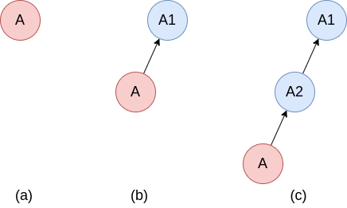
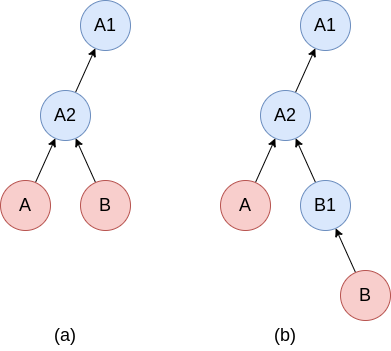

Transactions
============
Transactions is a feature that comes from SOFT, which allows to easy manage arbitrary long series of immutable (frozen) instances while ensuring provenance.  Conceptually it share many similarities with git.

A basic usage for transactions is to take snapshots of the current state of your system.  This is shown in Figure 1, where we assume that the instance `A` (which e.g. could be a collection) describes the state of your system.

We call an instance a *transaction* after we have taken a snapshot of it, i.e. when it contains a reference to a immutable "parent" instance.



**Figure 1**: *Creating a transaction by taking snapshots.  (a) initial state of your system described by instance `A`.  (b) creating a transaction by taking a snapshot
of `A`.  The snapshot, `A1`, stores an immutable (frozen) copy of `A` from the exact
moment `t1` the snapshot was taken.  (c) After another snapshot was taken at time `t2`.  Blue circles represent immutable instances, red circles represent mutable instances, while arrows relate an instance to its (frozen) parent instance.*

It is very simple to create such snapshots using the C API.  The steps in Figure 1 can be produced by the following code:
```C
DLiteInstance *A = dlite_instance_get("A");  // Initial state (Fig. 1a)
dlite_instance_snapshot(A);                  // Make snapshot at time=t1 (Fig. 1b)
// A is evolved...
dlite_instance_snapshot(A);                  // Make snapshot at time=t2 (Fig. 1c)
```

The snapshots can be accessed using `dlite_instance_get_snapshot()`.  For instance, accessing snapshot `A2` and creating a new branch from it can be achieved by the following four lines of C code:
```C
// Access the most resent snapshot of instance A.
// Note that A2 is a borrowed reference to the snapshot and should not be dereferred
// with dlite_instance_decref().
const DLiteInstance *A2 = dlite_instance_get_snapshot(A, 1);

// Create a mutable copy of A2.
// Note that B is a new reference.  You should call dlite_instance_decref() when you
// are done with it.
DLiteInstance *B = dlite_instance_copy(A2);

// Make B a transaction with A2 as parent. Shown Fig. 2a.
dlite_instance_set_parent(B, A2);

// Make a snapshop if B. Shown Fig. 2b.
dlite_instance_snapshot(B);
```
The result if these commands are shown in Figure 2.



**Figure 2**: *Creating a new branch, from a snapshot of a transaction.  (a) create a copy `B` of latest snapshot of transaction `A`.  (b)  Take a snapshot of `B`.*


### Transaction parent and immutability
All transactions starts with a root instance with no parent instance.  All other instances in a transaction has exactly one parent instance.
All instances in a transaction that serves as a parent are immutable (that is, all instances except the leafs).  Non-root transaction instances store a [SHA-3](https://en.wikipedia.org/wiki/SHA-3) hash of their parents together with the parent UUIDs.  This make it possible to ensure that any of the ancestors of a transaction has not been changed - providing provenance.

A transaction can be validated with `dlite_instance_transaction_validate()`.


### Memory management
Since the number of snapshots potentially can be very large, it is important to be able to store them to disk in order to save memory.  To support this, DLite implements the functions `dlite_instance_pull_snapshot()` and dlite_instance_push_snapshot()`:
```C
/**
  Like dlite_instance_get_snapshot(), except that possible stored
  snapshots are pulled from storage `s` to memory.

  Returns NULL on error.
 */
const DLiteInstance *dlite_instance_pull_snapshot(const DLiteInstance *inst,
                                                  DLiteStorage *s, int n);

/**
  Push all ancestors of snapshot number `n` from memory to storage `s`,
  where `n=0` corresponds to `inst`, `n=1` to the parent of `inst`, etc...

  No snapshot is pulled back from storage, so if the snapshots are
  already in storage, this function has no effect.

  This function starts pushing closest to the root to ensure that the
  transaction is in a consistent state at all times.

  Returns zero on success or the (positive) index of the snapshot that
  fails to push.
*/
int dlite_instance_push_snapshot(const DLiteInstance *inst, DLiteStorage *s, int n);
```
Note that not all storages can be used with these functions, since whether an instance is a transactions or not, is not described by its metadata and hence requires special support by the storage plugin.
