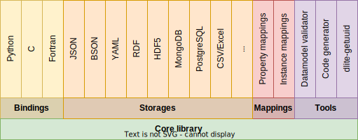
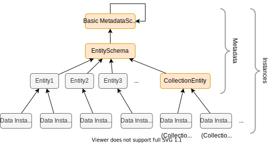
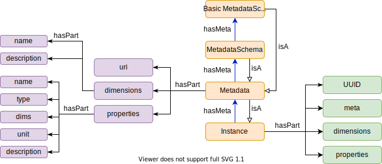

DLite Concepts
==============

DLite is an implementation of [SOFT], which stands for SINTEF Open
Framework and Tools and is a set of concepts for how to achieve
semantic interoperability as well as implementations and corresponding
tooling.

The development of SOFT was motivated by many years of experience with
developing scientific software, where it was observed that a lot of
efforts went into developing parts that had little to do with the
domain.
A significant part of the development process was spent on different
software engineering tasks, such as code design, the handling of I/O,
correct memory handling of the program state and writing import and
export filters in order to use data from different
sources.
In addition comes the code maintenance with support of legacy formats
and the introduction of new features and changes to internal data
state in the scientific software.
With SOFT it is possible to utilize reusable software components that
handle all this, or develop new reusable software components that can
be used by others in the same framework.
At the core of SOFT are the [SOFT data models], which by design provide
a simple but powerful way to represent scientific data.

Originally DLite started as a simplified pure C implementation of SOFT
based on [SOFT5], but has with time developed into a robust framework
with a large set of [features].
There is also [SOFT7], a new version of SOFT written in pure Python
where new features are tested out.

The main components of DLite are shown in Figure 1, including bindings
to several programming languages, tools, the plugin framework for
storages, and mappings.



_**Figure 1.** DLite Architecture._

DLite contains a core library, implementing a simple, but powerful
datamodel-based framework for semantic interoperability.
On top of this, it implements a set of bindings, storages, mappings
(using [tripper]) and tools.
The library also comes with a set of interfaces (API) to create
extensions and custom plugins.

DLite currently provides bindings with well-documented APIs to Python,
C and Fortran.
For C and Fortran it provides tools for code generation for easy and
efficient integration into simulation software.
The Python bindings are dynamic in nature and provide a simple way to
interact with semantic data from Python.

It also provides a plugin architecture for storages and mappings and
comes with a set of generic storages.
The plugins can be written either in C or Python and are available in any
of the bindings (including C and Fortran) due to the embedded Python
interpreter.

The main approach to developing software with DLite is to
incrementally describe the domain of the software using data models
(see below).
The data models can represent different elements of the software, and
be used in handling I/O as well as in code generation and
documentation.
Data models can also be used for annotating data and data sets.
This might be useful in cases where for instance the origin of the
data, license and ownership are of importance.

Since any complex software will have many data models and often multiple
instances of the same data model, DLite allows for creating collections of
data models with defined relationships.

One idea of SOFT is that software may be written is such way that
business logic is handled by the codebase, while I/O, file-formats,
version handling, data import/export and interoperability can be
handled by reusable components in the DLite-framework, thus reducing
risk and development time.


Datamodel hierarchy
-------------------



_**Figure 2.** Datamodel hierarchy.
The instances colored orange are predefined, while the other may be defined by the user.
Data instances 5 and 6 are what we normally will call a collection._

Figure 2 shows the datamodel hierarchy implemented in DLite.
As a user, you will almost always deal with only entities or data
instances, but the hierarchy gives DLite a strong and theoretically
well-defined schema.

An *instance* in DLite is a formal representation of a dataset.  It is
called an instance, because it is an instance of a data model (or
*metadata* using the DLite terminology).
This is similar to instances of classes in object oriented programming.

In DLite we often say that an instance is described by its metadata (aka data model).
The DLite metadata are themselves formalised and described by their meta-metadata.
Hence, metadata are instances, too.

At the lowest level of abstraction we have the actual data or *data
instances*.
Metadata that describe *data instances* are (for historical reasons
and compatibility with SOFT) called *entities*.
*Entities* are instances of the *EntitySchema*.
The *EntitySchema* is an instance of the *BasicMetadataSchema*, which is an
instance of itself (meaning that it can be used to describe itself).
Hence, in DLite **everything is an instance**.  This has a practical
implication that the API for instances can be applied to all metadata
as well.  Since the BasicMetadataSchema can describe itself, no more
abstraction levels are needed, making the DLite metadata schema
complete and well-defined.

From Figure 2, one can also see that *[collections]* are simply
instances of the *CollectionEntity*.

In DLite all instances that describe other instances (of a lower abstraction
level) are called *metadata*.

Compared to ontologies, *data instances* correspond to OWL individuals
while *entities* correspond to OWL classes.
OWL, which is based on first order logic, does not have concepts corresponding
to the higher abstraction levels of EntitySchema and BasicMetadataSchema.

A (so far unexplored possibility) with such a datamodel hierarchy is
that it can enable cross-platform semantic interoperability between
independent systems that describe their datamodel hierarchies using a
common BasicMetadataSchema.
Of course, this requires a common agreement on the BasicMetadataSchema.


### Entities
An entity can be a single thing or object that represents something
physical or nonphysical, concrete or abstract.
The entity contains information about the data that constitutes the
state of the object it describes.
The entity does not contain the actual data, but describes what the
different data fields are, in terms of name, data types, units,
dimensionality etc.
Information about data is often called metadata.
Formal meta data enables for the correct interpretation of a set of
data, which otherwise would be unreadable.

An example of an entity is 'Atom', which can be defined as something
that has a position, an atomic number (which characterizes the
chemical element), mass, charge, etc.
Another example of a completely different kind of entity can be a data
reference-entity with properties such as name, description, license,
access-url, media-type, format, etc. The first entity is suitable as
an object in a simulation code, while the latter is more suitable for
a data catalog distribution description (e.g. [dcat:Distribution]).
Entities allows for describing many aspects of the domain.
While each entity describes a single unit of information, a set of
entities can describe the complete domain.


#### Uniqueness & immutability
To ensure consistency, an entity (or other metadata) should never be
changed once published.
They are uniquely identified by their *URI*, which has 3 separate
elements: a namespace, a version number and a name.
An entity named 'Particle' is unlikely to have the same meaning and
the set of parameters across all domains.
In particle physics, the entity 'Particle' would constitute matter and
radiation, while in other fields the term 'Particle' can be a general
term to describe something small.
For this reason SOFT entities have namespaces, similar to how
vocabularies are defined in OWL.
The version number is a pragmatic solution to handle how properties of
an entity might evolve during the development process.
In order to handle different versions of a software, the entity
version number can be used to identify the necessary transformation
between two data sets.

For example, the URI for the EntitySchema is
http://onto-ns.com/meta/0.3/EntitySchema, with
`http://onto-ns.com/meta` being the namespace, `0.3` the version and
`EntitySchema` the name.
URIs do not have to be resolvable, but it is good practice that they
resolves to their definition.


### Instances
Instances are identified by a [universally unique identifier (UUID)],
which is a 128 bit label expressed as a string of the form
`8290318f-258e-54e2-9838-bb187881f996`.
Since metadata are instances, they also have a UUID (which is
calculated as a hash of their URI).

DLite also allows the user to identify a data instance with a human
readable URI.
Like for metadata, the UUID will then be calculated as a hash of the
URI.
The tool `dlite-getuuid` can be used to manually convert URIs to their
corresponding UUIDs.

Currently DLite does not enforce that user-defined URIs must follow
the [RFC 3986] standard for a [valid URI], but it is recommended to do
so in order to allow using the URI as a valid [RDF]
subject or object in a knowledge base.
For this purpose, DLite also allows to refer to data instances using
ids of the form `<metadata_uri>/<uuid>` (for example
http://onto-ns.com/meta/0.1/Collection/db6e092b-20f9-44c1-831b-bd597c96daae).


Metadata semantics
------------------


_**Figure 3**. The DLite data model._

The DLite data model is defined by the [Datamodel ontology] and shown
schematically in Figure 3.
In orange we have the same hierarchy as shown in Figure 2 with *instance*
as the most general concepts.

As discussed above, all instances have an UUID that is used as their
main identifier for database lookup.
All metadata as well as some data instances can also be identified by
a URI (in which case the UUID is a hash of this URI).
Instances also have a *meta* field that refer to the metadata that it
is described by (or that it is an instance of).

In general metadata describe their instances using *dimensions*,
*properties* and *relations*.
Properties describe data in terms of keyword-value pairs, dimensions
enable efficient description of multi-dimensional arrays and relations
can describe anything that can be represented in a knowledge base.
Together they provide a general means to describe all types of data
that can be represented digitally.
Note however, that not all metadata uses all of these three ways to
describe their instances.
For example, entities have only dimensions and properties.
Also note that dimensions and properties cannot have the same name, since
they are accessed from the same namespace.


### Dimension
A metadata dimension simply provides a *name* and a human *description* of a
given dimension of an array property.


### Property
A property describes an element or item of an instance and has the following
attributes:
- *name*: a name identifying the property.
- *type*: the type of the described property, f.ex. an integer.
- *$ref*: formally a part of type.
  `$ref` is used together with the "ref" type, which is a special datatype for
  referring to other instances.
- *shape*: The dimensions of multi-dimensional properties.
  This is a list of dimension expressions referring to the dimensions defined above.
  For instance, if an entity have dimensions with names `H`, `K` and `L` and
  a property with shape `["K", "H+1"]`, the property of an instance of this entity
  with dimension values `H=2, K=2, L=6` will have shape `[2, 3]`.
- *unit*: The unit of the property.
- *description*: A human description of the property.

Please note that *dims* is a now deprecated alias for *shape*.


### Relation
A RDF subject-predicate-object triplet.
Relations are currently not explored in metadata, but are included because of
their generality.
However, relations are heavily used in [collections].


### Representing an entity
Lets start to make a "Person" entity, where we want to describe his/her name, age and skills.

```json
{
  "uri": "http://onto-ns.com/meta/0.1/Person",
  "meta": "http://onto-ns.com/meta/0.3/EntitySchema",
  "description": "A person.",
  "dimensions": [
    {
      "name": "N",
      "description": "Number of skills."
    }
  ],
  "properties": [
    {
      "name": "name",
      "type": "string",
      "description": "Full name."
    },
    {
      "name": "age",
      "type": "float",
      "unit": "years",
      "description": "Age of person."
    },
    {
      "name": "skills",
      "type": "string",
      "shape": ["N"],
      "description": "List of skills."
    }
  ]
}
```

First we have "uri" identifying the entity, "meta" telling that this is an instance of the entity schema (hence an entity) and a human description.
Then comes "dimensions".
In this case one dimension named "N", which is the number of skills the person has.
Finally we have the properties; "name", "age" and "skills".
We see that "name" is represented as a string, "age" as a floating point number with unit years and "skills" as an array of strings, one for each skill.


### SOFT7 representation
Based on input from [SOFT7], DLite also supports a slightly shortened representation of entities.
The "Person" entity from the above example will in this representation, look like:

```json
{
  "uri": "http://onto-ns.com/meta/0.1/Person",
  "description": "A person.",
  "dimensions": {
    "N": "Number of skills."
  },
  "properties": {
    "name": {
      "type": "string",
      "description": "Full name."
    },
      "age": {
      "type": "float",
      "unit": "years",
      "description": "Age of person."
    },
      "skills": {
      "type": "string",
      "shape": ["N"],
      "description": "List of skills."
    }
  }
}
```

In this representation defaults the `meta` field to the entity schema if it is left out.
Dimensions and Properties are dictionaries (JSON objects) instead of arrays with the dimension or property name as key.

references
----------

[SOFT]: https://www.sintef.no/en/publications/publication/1553408/
[SOFT data models]: https://github.com/NanoSim/Porto/blob/porto/Preview-Final-Release/doc/manual/02_soft_introduction.md#soft5-features
[SOFT5]: https://github.com/NanoSim/Porto/blob/porto/Preview-Final-Release/doc/manual/02_soft_introduction.md
[SOFT7]: https://github.com/SINTEF/soft7
[features]: features.md
[collections]: collections.md
[dcat:Distribution]: https://www.w3.org/TR/vocab-dcat-3/#Class:Distribution
[UUID]: https://en.wikipedia.org/wiki/Universally_unique_identifier
[Datamodel ontology]: https://github.com/emmo-repo/datamodel

[RFC 3986]: https://datatracker.ietf.org/doc/html/rfc3986
[valid URI]: https://en.wikipedia.org/wiki/Uniform_Resource_Identifier#syntax
[RDF]: https://en.wikipedia.org/wiki/Semantic_triple
[fig1]: SOFT-metadata-structure.png "Figure 1. Metadata structure."
[tripper]: https://github.com/EMMC-ASBL/tripper
