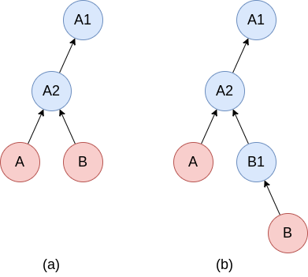

Transactions
============
The Transaction concept comes from SOFT. It allows to easily manage arbitrary long series of immutable (frozen) instances, while ensuring provenance.
Conceptually, it shares many similarities with [git](https://git-scm.com).

A basic usage for transactions is to take snapshots of the current state of your system.
This is shown in Figure 1, where we assume that the instance `A` (which, e.g., could be a collection) describes the state of your system.

We call an instance a *transaction* after we have taken a snapshot of it, i.e. when it contains a reference to an immutable previous ("parent") instance.


**Figure 1**: *Creating a transaction by taking snapshots.
(a) initial state of your system described by instance `A`.
(b) creating a transaction by taking a snapshot of `A` at time `t1`.
The snapshot, `A1`, stores an immutable (frozen) copy of `A` from the exact moment `t1` the snapshot was taken.
(c) After another snapshot was taken at a later time `t2`.
Blue circles represent immutable instances, red circles represent mutable instances, while arrows relate an instance to its (frozen) parent instance.*

It is straight forward to create such snapshots using the Python and C APIs.
In Python, the steps in Figure 1 can be produced by the following code:

```python
A = dlite.get_instance("A")  # Initial state (Fig. 1a)
A.snapshot()                 # Make snapshot at time=t1 (Fig. 1b)
# A is evolved...
A.snapshot()                 # Make snapshot at time=t2 (Fig. 1c)
```

The corresponding code in C would be:

```C
DLiteInstance *A = dlite_instance_get("A");  // Initial state (Fig. 1a)
dlite_instance_snapshot(A);                  // Make snapshot at time=t1 (Fig. 1b)
// A is evolved...
dlite_instance_snapshot(A);                  // Make snapshot at time=t2 (Fig. 1c)
```

The snapshots can be accessed using `dlite_instance_get_snapshot()`.
For instance, accessing snapshot `A2` and creating a new branch from it can be achieved by the following four lines of Python code:

```python
A2 = A.get_snapshot()  # Access the most recent snapshot of A
B = A2.copy()          # Create a mutable copy of A2
B.set_parent(A2)       # Make B a transaction with A2 as parent. Shown in Fig. 2a.
B.shapshot()           # Make a snapshop of B. Shown in Fig. 2b.
```

The corresponding C code is:

```C
// Access the most recent snapshot of instance A.
// Note that A2 is a borrowed reference to the snapshot and should not be
// dereferenced with dlite_instance_decref().
const DLiteInstance *A2 = dlite_instance_get_snapshot(A, 1);

// Create a mutable copy of A2.
// Note that B is a new reference.  You should call dlite_instance_decref() when you
// are done with it.
DLiteInstance *B = dlite_instance_copy(A2);

// Make B a transaction with A2 as parent. Shown in Fig. 2a.
dlite_instance_set_parent(B, A2);

// Make a snapshop of B. Shown in Fig. 2b.
dlite_instance_snapshot(B);
```
The result of these commands are shown in Figure 2.



**Figure 2**: *Creating a new branch, from a snapshot of a transaction.
(a) Create a copy (`B`) of latest snapshot of transaction `A`.
(b) Take a snapshot of `B`.*

Transaction parent and immutability
-----------------------------------

All transactions start as a root instance with no parent instance.
All other instances in a transaction has exactly **one** parent instance.
All instances in a transaction that serve as a parent are immutable (that is, all instances except the leaves (the latest)).
Non-root transaction instances store a [SHA-3](https://en.wikipedia.org/wiki/SHA-3) hash of their parent together with the parent UUID.
This makes it possible to ensure that any of the ancestors of a transaction have not been changed - providing provenance.

A transaction can be verified with the `verify_transaction()` method in Python and `dlite_instance_verify_transaction()` in C.

Memory management
-----------------------------------

The number of snapshots can potentially be very large, hence it is important to be able to store them to disk in order to save memory.
To support this, DLite implements the `pull_snapshot()` and `push_snapshot()` methods (`dlite_instance_pull_snapshot()` and `dlite_instance_push_snapshot()` in C).

Calling `inst.push_snapshot(storage, n)` will push all ancestors of snapshot `n` of instance `inst` from memory to storage `storage`, where `n=0` corresponds to `inst`, `n=1` to the parent of `inst`, etc...  Hence, this will release memory.

Calling `inst.pull_snapshot(storage, n)` will pull snapshot `n` of instance `inst` as well as all its descendants from storage `storage` to memory.  Hence, this is similar to `inst.get_snapshot(n)`, except that an explicit storage is used.

Note that not all storages can be used with these functions, since whether an instance is a transactions or not, is not described by its metadata and hence requires special support by the storage plugin.
