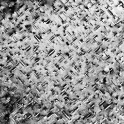

Example of working with TEM data
================================

Datasets
--------
This case is about three TEM images of a Al-Mg-Si aluminium alloy.

Setup
-----
Create a new virtual environment and install needed packages

    pip install -r requirements.txt
