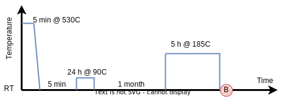

TEM data Example
================
This example demonstrates how a user can access and combine different
datasets and represent them in the form he or she needs.

The basic idea is to semantically document both the datasets and the
different ways one want to represent them as.

The example uses DLite as the underlying interoperability framework,
but also introduces a set of other tools for working with semantically
documented data.


Content
-------
- [Background](#background)
- [Data resources](#data-resources)
- [Workflow](#workflow)
- [Setup](#setup)
- [Running the example](#running-the-example)
  - [Initialisation](#initialisation)
  - [Accessing the knowledge base](#accessing-the-knowledge-base)
  - [Listing the data resources in the knowledge base](#listing-the-data-resources-in-the-knowledge-base)
  - [Accessing data](#accessing-data)
- [Acknowledgments](#acknowledgments)


Background
----------
This example is about studying an Al-Mg-Si aluminium alloy using
transition electron microscopy (TEM).  The aim of such studies is to
understand how the alloy composition and heat treatment influences the
microstructure and how the microstructure in turn influences the alloy
properties.  Based such understanding, new alloys with improved or
tailored properties can be developed.

In this very simple example, we will look at a single Al-Mg-Si alloy
at two conditions, after exposing it for two different heat treatments.

The first heat treatment we denote DA (for direct aged), where the
alloy was solution heat treated for 5 min at 530C and then quenched to
room temperature (RT) and then immediately aged for 5 hours at 185C.


*Figure: Heat treatment profile for condition A.  Direct aging.*

Two bright-field TEM images were acquired from a sample prepared after
the aging (marked with A in the profile above).  The first is a
low-magnification images showing a dense distribution of needle-shaped
beta" precipitates.


*Figure: Low-magnification TEM bright-field image;
[pm:TEM_BF_100-at-m5-and-2_001]*

The second image zooms in to a smaller region.  The dark dots are
beta" precipitates viewed along the needle-direction.


*Figure: Zoom-in of the above TEM bright-field image; [pm:TEM_040]*

The second heat treatment we denote NA (for natural aged), where the
alloy after solution heat treatment was kept at RT for 1 month before
aging.  It was also pre-baked for 24h at 90C.



*Figure: Heat treatment profile for condition B.  Natural aging.*

An atomic-resolution high angle annular dark-field (HAADF) TEM image
was acquired from a sample prepared after aging (marked with B in the
profile above).  It shows three beta" precipitates viewed along the
needle direction.


*Figure: High angle annular dark field TEM image; [pm:TEM_6c8cm_008]*

By analysing a set of such TEM images as showed above, one can
characterise the alloy microstructure in terms of precipitates types
and size distributions.

To relate the microstructure to mechanical properties of the alloy,
Vickers hardness measurements was performed at each of the two
conditions.


Data resources
--------------
The data resources can be divided into two types, *data sources*
with our initial knowledge or raw data obtained directly from
experiments and *data sinks* that correspond to different derived
representations of the primary data sources.

All data resources are uniquely identified with an IRI, where we are using
the prefix [pm:] as a common namespace.

All data resources used in this example are documented in the
[data/resources.yaml] file, which will be used to populate the
knowledge base in this demo.

**Data sources**
- **Raw TEM images** stored in the Gatan DM3 format.  These images are large
  and can be downloaded from https://folk.ntnu.no/friisj/temdata/.
  They can be parsed using the [dm3 plugin].
  *IRIs:* [pm:TEM_BF_100-at-m5-and-2_001], [pm:TEM_040] and [pm:TEM_6c8cm_008].
- **Alloy composition**.  Obtained from a chemical analysis of the alloy and
  stored in a csv file with numbers in weight-percent.
  *IRI:* [pm:alloy_composition].

**Data sinks**
- **Thumbnail image**. A viewable png thumbnail extracted from a raw DM3.
  IRI: [pm:thumbnail_image].
- **Microscope settings**. These are obtained from the metadata of the DM3 files
  and stored in json format. *IRI:* [pm:microscope_settings].
- **Precipitate statistics**.  Obtained from post-processing the TEM images using
  the image analyser.  *IRI:* [pm:precipitate_statistics].
- **Precipitation model input** is a file in a custom text-based format.
  Obtained via property mappings from the alloy composition and precipitate
  statistics.  *IRI:* [pm:precipitation_model_input].

**Transformations**
- **Image analyser**. This resource is a (hypothetical) *TEM image analyser*
  software that function both as a sink (takes a DM3 file as input)
  and a source (calculates precipitation statistics).  It is implemented as a
  Python function. *IRI:* [pm:image_analyser].


Workflow
--------
The overall workflow for this example is shown in the figure below:


*Figure: Schematics of the overall workflow for this example.
After the documentation is done, the user can mix and match data
sources and sinks in a very flexible way.*

All the data resources are associated with a data model (DLite Metadata).
The microscope settings is associated with the [TEMImage] datamodel and
the TEM image analyser takes a [TEMImage] instance as input and returns a
[PrecipitateStatistics] instance.

The workflow includes three different ways to connect a data sink to a
data source:

* **Generate**. In this case the sink and source shares the same data
  model.  The generate step simply serialises the source data model in
  the desired format. A generation step is normally also applied after
  property mappings and conversion.  The thumbnail image (png),
  microscope settings (json), precipitate statistics (csv) and the
  precipitation model input (txt) are all produced by a generator.

* **Property mappings** allows to automatically create and populate an
  instance of a data model that represents the data as required by the
  user.  See the [mappings example] for more information.  Property
  mappings are here used to both instantiate an [Image] data model
  from a [TEMImage] instance and to instantiate a [Chemistry] by
  combining a [PrecipitateStatistics] and [Composition] data model.

* **Convert** is a transformation that takes one or more data models
  as input and return one or more data models as output. It is implemented
  as a Python function.  Conversions are similar to property mappings,
  but operates on instances instead of individual properties.
  The *TEM image analyser* is implemented as a converter.  It takes
  an instance of a [TEMImage] data model and returns an instance of
  a [PrecipitateStatistics] data model.


Setup
-----
Create a new virtual environment and install needed packages

    pip install -r requirements.txt


Running the example
-------------------
The main example can be found in the [demo.py] script. We will here go
through it step by step.

### Initialisation
In addition to define the input and output data directories to use in this
example, the line

```python
from paths import indir, outdir
```

also sets up search paths for DLite and include this example directory in
the Python module search path (see [paths.py]):

```python
dlite.storage_path.append(entitydir)
dlite.python_storage_plugin_path.append(plugindir)

sys.path.append(str(exampledir))
```

The line

```python
from utils.utils import get_data, populate_triplestore
```

imports the two main functions that we will use in this example.


### Accessing the knowledge base
To be independent of the underlying triplestore implementation, we use
tripper to access the knowledge base.  For the purpose of this demo we
use the *rdflib* backend.  We also prepare the knowledge base by
populating it with the documentation of all the data resources from
the YAML file [data/resources.yaml].

```python
ts = Triplestore(backend="rdflib")
populate_triplestore(ts, indir / "resources.yaml")
```

Lets also define some handy tripper namespaces

```python
OTEIO = Namespace("http://emmo.info/oteio#")
PM = ts.bind("pm", "https://www.ntnu.edu/physmet/data#")
```


### Listing the data resources in the knowledge base
Lets see the data sources and sinks that we have documented.

```python
# List all data sources and sinks
>>> print("Data sources:")
>>> for source in ts.subjects(RDF.type, OTEIO.DataSource):
...     print("  -", source)
>>> print()
>>> print("Data sinks:")
>>> for sink in ts.subjects(RDF.type, OTEIO.DataSink):
...     print("  -", sink)
Data sources:
  - https://www.ntnu.edu/physmet/data#TEM_BF_100-at-m5-and-2_001
  - https://www.ntnu.edu/physmet/data#TEM_040
  - https://www.ntnu.edu/physmet/data#TEM_6c8cm_008
  - https://www.ntnu.edu/physmet/data#alloy_composition

Data sinks:
  - https://www.ntnu.edu/physmet/data#thumbnail_image
  - https://www.ntnu.edu/physmet/data#microscope_settings
  - https://www.ntnu.edu/physmet/data#image_analyser
  - https://www.ntnu.edu/physmet/data#precipitate_statistics
  - https://www.ntnu.edu/physmet/data#precipitation_model_input
```

(See the OntoTrans [Exploratory Search System (ESS)] by TU Wien
for an example of how to data in a knowledge base can be explored.)


### Accessing data

#### Get thumbnail image
Lets now use the system to get a thumbnail image for the TEM image
[pm:TEM_6c8cm_008] (with "pm:" being the namespace prefix we defined
above).  This can be achieved calling the `get_data()` function:

```python
# Get a thumbnail of pm:TEM_6c8cm_008
get_data(ts, steps=(PM.TEM_6c8cm_008, PM.thumbnail_image))
```

This function will under the hood query the triplestore for the data
documentation of the two data resources passed as arguments and create
partial OTEAPI pipelines for them.  It will then connect the two
partial pipelines into a full pipeline and execute it as shown in the
figure below.


*Figure: Underlying OTEAPI pipeline for creating a thumbnail from a TEM image.*

The result will be that the file `output/thumbnail.png` as location in
the documentation of the thumbnail image will be created.

**Note**, as arguments to `get_data()` we only provide the triplestore and
the IRIs for the data source and sink we want to connect.


#### Get microscope settings
Similarly we can get microscope settings for TEM image [pm:TEM_040]:
```python
# Get microscope setting for pm:TEM_040
get_data(ts, steps=(PM.TEM_040, PM.microscope_settings))
```


*Figure: Underlying OTEAPI pipeline for extracting microscope settings
from a TEM image.*


#### Get precipitation statistics
To get the precipitation statistics, we also have to specify that we want
to calculate it using the image analyser.  Hence, we need to provide
three IRIs in this case:

```python
# Get precipitation statistics for pm:TEM_BF_100-at-m5-and-2_001
get_data(ts, steps=(
    PM["TEM_BF_100-at-m5-and-2_001"],  # TEM image to analyse
    PM.image_analyser,                 # Postprocess with the image analyser
    PM.precipitate_statistics,         # How to present the result
))
```


*Figure: Underlying OTEAPI pipeline for calculating precipitate
statistics from a TEM image.*


#### Get input to presipitation model
To generate an input file to a (thought) precipitation model, we need
to combine two data sources, the alloy composition and the analysed
precipitate statistics for a TEM image.  This can be done by simply
include the IRI of the extra data source before it is needed:

```python
# Get input to presipitation model based on the combination of the
# alloy composition and precipitation statistics obtained from
# postprocessing TEM image pm:TEM_6c8cm_008.
get_data(ts, steps=(
    PM.alloy_composition,          # Data source 1: alloy composition
    PM.TEM_6c8cm_008,              # Data source 2: TEM image
    PM.image_analyser,             # Postprocess with the image analyser
    PM.precipitation_model_input,  # How to present the result
))
```


*Figure: Underlying OTEAPI pipeline for creating a precipitation model input file
from the alloy composition and a TEM image.*


Acknowledgments
---------------
We kindly acknowledge Calin Marioara for providing the TEM images and
some background information.


[pm:]: https://www.ntnu.edu/physmet/data#
[pm:TEM_BF_100-at-m5-and-2_001]: https://folk.ntnu.no/friisj/temdata/BF_100-at-m5-and-2_001.dm3
[pm:TEM_040]: https://folk.ntnu.no/friisj/temdata/040.dm3
[pm:TEM_6c8cm_008]: https://folk.ntnu.no/friisj/temdata/6c8cm_008.dm3
[pm:thumbnail_image]: figs/BF_100-at-m5-and-2_001.png
[pm:alloy_composition]: data/composition.csv
[pm:microscope_settings]: data/BF_100-at-m5-and-2_001.json
[pm:precipitate_statistics]: data/precipitate_statistics.csv
[pm:image_analyser]: temdata/image_analyser.py
[pm:hardness]: data/hardness.csv
[pm:precipitation_model_input]: data/precip.txt

[TEMImage]: entities/TEMImage.json
[Composition]: entities/Composition.json
[Image]: entities/Image.json
[PrecipitateStatistics]: entities/PrecipitateStatistics.json
[Chemistry]: entities/Chemistry.json

[oteapi-services]: https://github.com/EMMC-ASBL/oteapi-services
[dm3 plugin]: plugins/dm3.py
[mappings example]: https://github.com/SINTEF/dlite/tree/master/examples/mappings/
[demo.py]: demo.py
[paths.py]: paths.py
[data/resources.yaml]: data/resources.yaml

[Exploratory Search System (ESS)]: http://alloy.semantic-systems.cc/explore/with/search?q=Precipitation
