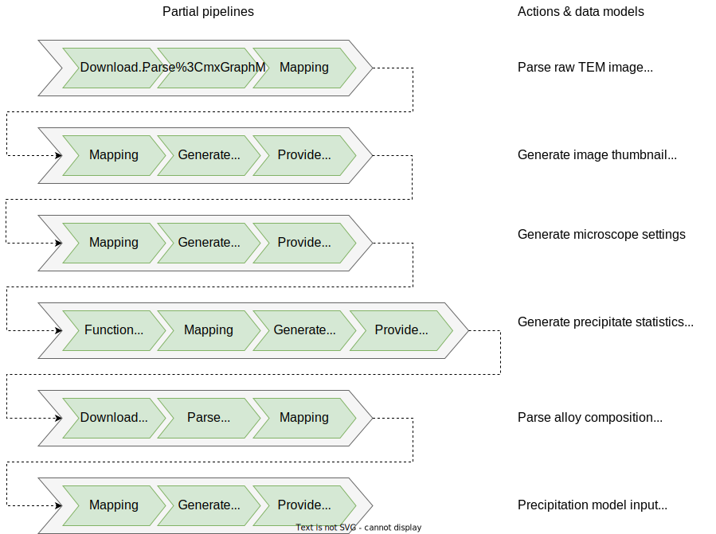

TEM data Example
================

Content
-------
- [Background](#background)
- [Datasets](#datasets)
- [Workflow](#workflow)
- [Setup](#setup)
- [Running the example](#running-the-example)
- [Acknowledgments](#acknowledgments)

Background
----------
This example is about studying an Al-Mg-Si aluminium alloy using
transition electron microscopy (TEM).  The aim of such studies is to
understand how the alloy composition and heat treatment influences the
microstructure and how the microstructure in turn influences the alloy
properties.  Based such understanding, new alloys with improved or
tailored properties can be developed.

In this very simple example, we will look at a single Al-Mg-Si alloy
at two conditions, after exposing it for two different heat treatments.

The first heat treatment we denote DA (for direct aged), where the
alloy was solution heat treated for 5 min at 530C and then quenched to
room temperature (RT) and then immediately aged for 5 hours at 185C.

*Figure: Heat treatment profile for condition A.  Direct aging.*

Two bright-field TEM images were acquired from a sample prepared after
the aging (marked with A in the profile above).  The first is a
low-magnification images showing a dense distribution of needle-shaped
beta" precipitates.

*Figure: Low-magnification TEM bright-field image; [BF_100-at-m5-and-2_001]*

The second image zooms in to a smaller region.  The dark dots are
beta" precipitates viewed along the needle-direction.

*Figure: Zoom-in of the above TEM bright-field image; [040]*

The second heat treatment we denote NA (for natural aged), where the
alloy after solution heat treatment was kept at RT for 1 month before
aging.  It was also pre-baked for 24h at 90C.

*Figure: Heat treatment profile for condition B.  Natural aging.*

An atomic-resolution high angle annular dark-field (HAADF) TEM image
was acquired from a sample prepared after aging (marked with B in the
profile above).  It shows three beta" precipitates viewed along the
needle direction.

*Figure: High angle annular dark field TEM image; [6c8cm_008]*

By analysing a set of such TEM images as showed above, one can
characterise the alloy microstructure in terms of precipitates types
and size distributions.

To relate the microstructure to mechanical properties of the alloy,
Vickers hardness measurements was performed at each of the two
conditions.

Datasets
--------
The datasets can be divided into two types, *primary datasets* with our
initial knowledge or raw data obtained directly from experiments and
*secondary datasets* that are derived from the primary datasets.

**Primary datasets**
- Raw images.  The images [BF_100-at-m5-and-2_001], [040] and [6c8cm_008]
  are in Gatan DM3 format and are very large.  They can be downloaded from
  https://folk.ntnu.no/friisj/temdata/.  They can be parsed using the
  [dm3 plugin].  These images have been acquired by Calin Marioara.
- Alloy composition.  Obtained from a chemical analysis of the alloy and
  stored in [data/composition.csv].  Numbers are in weight-percent.
- Hardness measurements.  Obtained from hardness measurements and stored
  in [data/hardness.csv].

**Derived datasets**
- Microscope settings. These are obtained from the metadata of the DM3 files
  and stored in json format in [data/BF_100-at-m5-and-2_001.json],
  [data/040.json] and [data/6c8cm_008.json].
- Precipitate statistics.  Obtained from analysing the TEM image at the two
  conditions and stored in [data/precipitate_statistics.csv].
- Precipitation model input file in a custom text-based format.  This will be
  the final dataset obtained when running the workflow.  Obtained via
  property mappings from the alloy composition and precipitate
  statistics.  Stored in [data/precip.txt].

Workflow
--------
The overall workflow for this example is as follows:

*Figure: Schematics of the overall workflow for this example.*

On the left we have the input datasets; a raw TEM image and the alloy
composition.  Three different types of post-processing are applied to
the TEM image: (i) property mappings for converting to a png thumbnail
image, (ii) a generator that writes the microscope settings and (iii)
a pre-processor that calculates the precipitate statistics.  Finally,
using property mappings, we can combine the alloy composition with the
precipitate statistics to produce an input file for a precipitation
model.

The workflow in the schematic figure above can be implemented as a
OTEAPI pipeline.  Note that implementing the workflow as a single
pipeline, as we do here, only works well if the conversion are fast.

*Figure: The above workflow represented as a pipeline.*

The figure below zooms in on the first partial pipeline, that
downloads the TEM image, parses it into an instance of the TEMImage
datamodel and maps the data model properties to corresponding
ontological concepts.  This partial pipeline provides a full
documentation of the [BF_100-at-m5-and-2_001] TEM image.

*Figure: First partial pipeline documenting a TEM image.*

Setup
-----
Create a new virtual environment and install needed packages

    pip install -r requirements.txt

Make sure that you have docker and docker-compose installed and the
docker deamon is running.  Then start the OTEAPI-services with
docker-compose:

    docker-compose pull   # Pull the latest images
    docker-compose up -d  # Run the OTE Services (detached)

Running the example
-------------------
Now you are ready to run the pipeline

   python pipeline.py

Acknowledgments
---------------
We kindly acknowledge Calin Marioara for providing the TEM images and
some background information.

[BF_100-at-m5-and-2_001]: https://folk.ntnu.no/friisj/temdata/BF_100-at-m5-and-2_001.dm3
[040]: https://folk.ntnu.no/friisj/temdata/040.dm3
[6c8cm_008]: https://folk.ntnu.no/friisj/temdata/6c8cm_008.dm3
[oteapi-services]: https://github.com/EMMC-ASBL/oteapi-services

[dm3 plugin]: plugins/dm3.py
[data/composition.csv]: data/composition.csv
[data/precipitate_statistics.csv]: data/precipitate_statistics.csv
[data/hardness.csv]: data/hardness.csv
[data/precip.txt]: data/precip.txt
[data/BF_100-at-m5-and-2_001.json]: data/BF_100-at-m5-and-2_001.json
[data/040.json]: data/040.json
[data/6c8cm_008.json]: data/6c8cm_008.json
