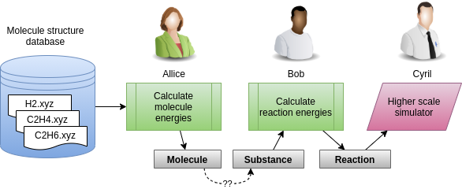
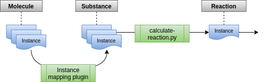

# A simple real world example for using dlite for chemical reaction and process

We want to be able to calculate the reaction energy of the following dehydrogenation reaction:

 C2H4(g) + H2(g)" width="500px">

The structure of all the involved molecules are stored in the folder
[molecules](molecules) in the
[xyz](https://en.wikipedia.org/wiki/XYZ_file_format) file format.  For now we consider this as our poor man's database, which we will use as input to the following workflow:



This workflow involves three people that decided to use dlite for interoperability:
* __Alice__ from Australia, who is an expert on molecular modelling.  She uses
  [ASE](https://wiki.fysik.dtu.dk/ase/) to calculate the molecule energies and
  store them in a dlite collection as instances of [Molecule] metadata.
* __Bob__ from Belgium, who know how to calculate reaction energies.  His software takes instances of [Substance] metadata as input and returns an instance of [Reaction] as output.
* __Cyril__ from Corsica is the end user is this user case and need the reaction energies as input to higher-scale simulations.  He is happy to read the input in terms of an instance of [Reaction] metadata.

Hence, the interesting step in this workflow is the conversion from [Molecule] instances of Alice to [Substance] instances needed by Bob.
We will provide four different implementations of this workflow, with increasing level of semantic interoperability:

1. [Explicit exchange of DLite instances](#workflow-1-explicit-exchange-of-dlite-instances)
2. [Static instance-based mapping](#workflow-2-static-instance-based-mapping)
3. [Dynamic property-based mappings](#workflow-3-dynamic-property-based-mappings)
4. [Ontologically described transformations](#workflow-4-ontologically-described-transformations)


## Workflow 1: Explicit exchange of DLite instances
Alice, Bob and Cyril have met at a summer school in Copenhagen and are setting up this workflow together.  Because of this close interaction, Bob makes a variant of his reaction script, called [calculate_reaction.py], that takes instances of [Molecule] metadata as input.  Hence the workflow reduces to


with two calculation steps.

* Alice starts by creating a script [molecular-energies.py] which you can run with

      python 1-simple-workflow/molecular_energies.py

  It does the following:
  - reads all the molecule structures in the [molecules](molecules) directory
  - calculates the corresponding molecule ground state energies using the [ASE EMT](https://wiki.fysik.dtu.dk/ase/ase/calculators/emt.html#module-ase.calculators.emt) calculator
  - for each molecule, instantiates a DLite [Molecule] instance populated with the structure information and calculated energy
  - add all the [Molecule] instances to a new collection
  - write the collection to disk: atomscaledata.json

* Bob makes a variant of his reaction script, called [calculate-reaction.py], that can be executed with

        python 1-simple-workflow/calculate_reaction.py

  It does the following:
  - loads the [atomscaledata.json](1-simple-workflow/atomscaledata.json) database
  - use that to calculate the energy of the chemical reaction `C2H6(g) --> C2H4(g) + H2(g)`
  - populate a new [Reaction] instance
  - write the new Reaction instance to [file](1-simple-workflow/ethane-dehydrogenation.json)
  - prints the calculated reaction energy to screen


## Workflow 2: Static instance-based mapping
Alice, Bob and Cyril have left Copenhagen and gone home to their respective countries and continue the work separately.
* Alice calculates more molecules and makes the results available in an online database.
* Bob improves his chemical reaction software that takes instances of [Substance] as input.  To also support reading [Molecule] instances as input, he creates a _DLite mapping plugin_ [molecule2substance](python-mapping-plugins/molecule2substance.py) in the [python-mapping-plugins/](python-mapping-plugins) subdirectory, which transparently can instantiate an instance of [Substance] from an instance of [Molecule].  In his updated [Python module](2-instance-mappings/reaction_energy.py) he has provides a second argument to `coll.get()`:

  ```python
  substance = coll.get(label, substance_id)
  ```

  that instructs DLite to convert the instance referred to by `label` to an instance of metadata `substance_id='http://onto-ns.com/meta/0.1/Substance'`.
* Cyril performs more simulations and would like to utilise the new results from Alice.  He uses the mapping plugin provided by Bob.  He installs the mapping plugin and creates a small [script](2-instance-mappings/calculate_reactions.py) that imports the reaction_energy module by Bob.

The workflow now looks as follows



and can be run with the script of Cyril

    python 2-instance-mappings/calculate_reactions.py


## Workflow 3: Dynamic property-based mappings
Alice and Bob have learned about ontologies and FAIR data, and realised that mapping their data to ontological concepts is a very good way to make it available for others.


Two examples are provided:

* Example 1. The mappings are hard-coded into the run script, which can be run directly with python.
Note that the data are obtained from same [collection of molecules](#1-simple-workflow/atomscaledata.json) as in the two
previous cases.

The actual mapping betweeen the instances of required molecules in the [collection of molecules](#1-simple-workflow/atomscaledata.json)  and the Substance instances needed in the reaction calculation (`get_energy`) is done with the dlite function `make_instance`.
Arguments provided are the target metadata (here Substance), instance(s) that the new Substance instance should be populated from and the mappings.
See documentation for other possible arguments.


    python 3-property-mappings/mappings_hard_coded/run.py


* Example 2. The mappings are obtained by use of separate mapping to the same ontology.

In this final example a situation in which two separate processes are mapped to the same ontology is showcased, thus enabling interoperability even though the users do not have detailed knowledge about both cases.


First, the mappings to the common ontology (chemistry.ttl) are first done with the scripts map_molecule.py and map_substance.py, resulting in two ontologies with the actual mappings. This step requires the python package EMMOntoPy.
Install EMMOntoPy from github and not PyPi to obtain some needed functionality not yet in the released version.
With this procedure, Alice and Bob can make mappings to the same ontology without reference to each other.
As a result the chemical reaction software can utilise any database of molecules that has been mapped to the same ontology (and that contains the required properties).
Alice's data are now available to anyone who knows the ontology.

In the second step these mappings are read into the run script and combined into a list of triples for all relevant mappings.
Mapping between data form the external repository and Bobs desired Substance(s) is then done automatically because of the common ontology.

Discussion on choice of ontology is not part of this dlite example, but Bob could also have used another ontology and match to something else and thus
also have access to other data repos mapped to other ontologies.

    python 3-property-mappings/mappings_from_ontology/run_w_onto.py


## Workflow 4: Ontologically described transformations

TODO: write up
- use OTEAPI
- ProMo(?)


## Metadata used in the example
You find all metadata in this example in the [entities](entities) folder.

### Molecule data model
First we define a DLite data model describing a [Molecule].
In addition to the information available in the structures, this data model also has a ground state energy property.

### Substance data model
The [substance] data model is very simple. It only defines two properties, an id (or name) identifying a substance and its molecular energy.

### Reaction data model
The [Reaction] data model defines a chemical reaction including its reaction energy.  It has two dimensions; the number of reactants and the number of products.


[Molecule]: entities/Molecule.json
[Substance]: entities/Substance.json
[Reaction]: entities/Reaction.json
[molecular-energies.py]: 1-simple-workflow/molecular-energies.py
[calculate-reaction.py]: 1-simple-workflow/calculate-reaction.py


1. simple workflow that explicitly calculates the reaction energy of the `C2H6(g) --> C2H4(g) + H2(g)` reaction
2. like workflow 1, but replaces the explicit calculation of the reaction energy
   in the second step with dlite mappings
3. like workflow 2, but uses ontological mappings to generate the dlite mappings
