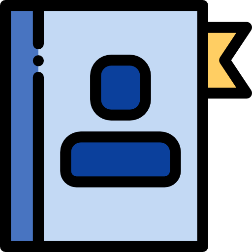

# DLite

_A lightweight data-centric framework for semantic interoperability._

:::{toctree}
:maxdepth: 2
:caption: Contents
:hidden:
:includehidden:

getting_started/index
user_guide/index
api_reference/index
contributors_guide/index
license
:::

::::{grid} 1 2 2 2
:::{grid-item-card} Getting started
:link: getting_started/index.html

:::
:::{grid-item-card} User Guide
:link: user_guide/index.html

:::
::::

::::{grid} 1 2 2 2
:::{grid-item-card} API Reference
:link: api_reference/index.html

:::
:::{grid-item-card} Contributor's Guide
:link: contributors_guide/index.html

:::
::::

## Indices and tables

* 
* 
